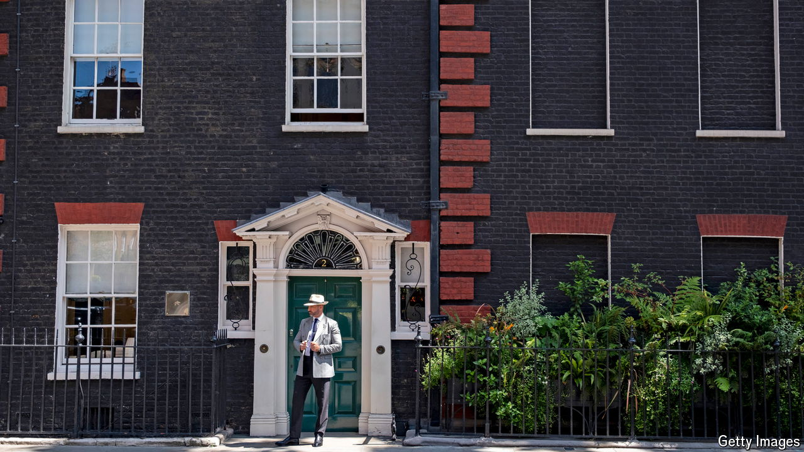

###### The ticked-off well-off

# Is Britain’s government at war with the wealthy? 

##### Speculation about the budget on October 30th has spooked some rich people 

 

> Oct 17th 2024 

Wealthy people have distinctive hobbies. One of them is talking, often noisily, about moving abroad to escape high taxes. In the run-up to the Labour government’s first budget, due on October 30th, rich Britons have some cause for concern. Rachel Reeves, the chancellor, has spoken of the need for higher taxes but also pledged no further levies on “working people”. Sir Keir Starmer, the prime minister, has said that “the broadest shoulders should bear the heavier burden”. 

