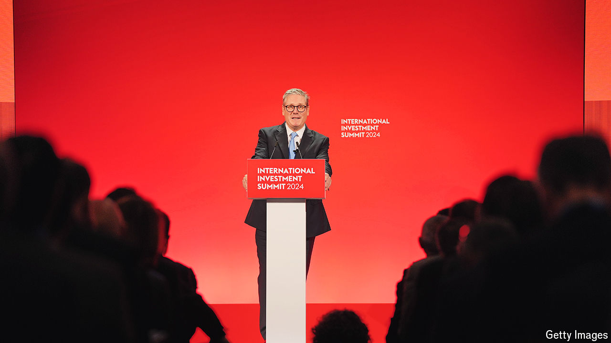

###### They will come and build it

# Sir Keir Starmer’s elevator pitch for investment 

##### In an interview with The Economist, the prime minister sets out his stall 

 

> Oct 14th 2024 

Investor summits follow a standard recipe. First come the speeches. The 200-odd executives who made it to an international investment summit in London on October 14th heard from Sir Keir Starmer, the prime minister, that after almost a decade of political turmoil in Britain, stability has returned. Labour’s landslide majority on July 4th means that the government’s decisions can be “measured in years, not months”, Sir Keir told  in an interview. Then comes the glitz. Delegates were whisked to St Paul’s Cathedral, to be greeted by Charles III and serenaded by Sir Elton John, a musician. 

