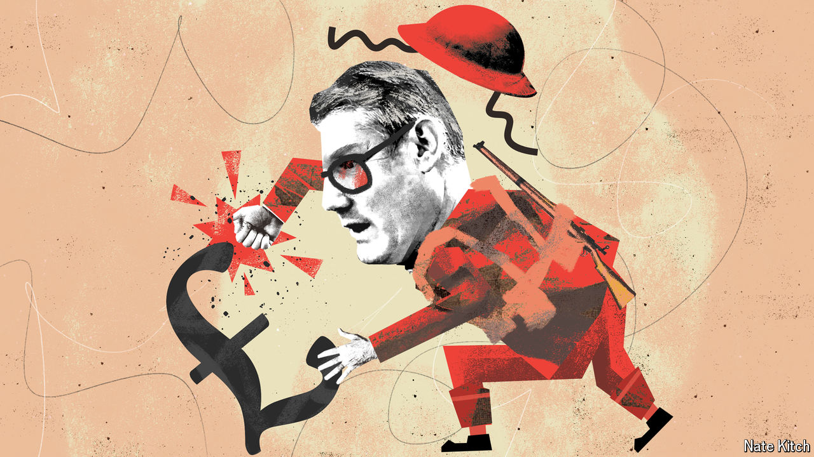

###### Bagehot

# The war on prices: British edition 

##### Too often, politicians see prices as something to be fought 

 

> Oct 16th 2024 

Every few decades the American government declares war on a noun, and the British government meekly follows along. In the 1970s it was Richard Nixon’s war on drugs, which shaped British drug policy for a generation. In the 2000s it was George W. Bush’s war on terror, which the British government keenly joined. Now another war has come along: the “war on prices”.

