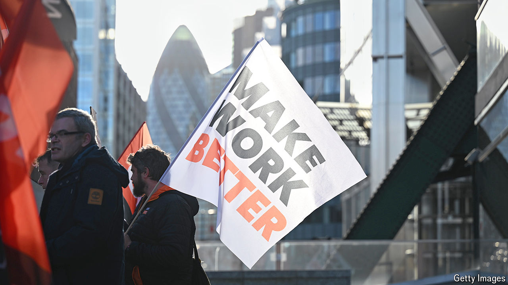

###### Tech brothers

# Trade unions have their eye on Britain’s tech sector 

##### The government’s plans to strengthen workers’ rights may help their cause 

 

> Oct 17th 2024 

Tech firms are known for the large salaries and ostentatious perks they bestow on workers: office slides, ball-pit meeting rooms and back massages. These companies tend to be less keen on the idea of employees joining a trade union. In Britain, however, they will soon have less choice in the matter.

