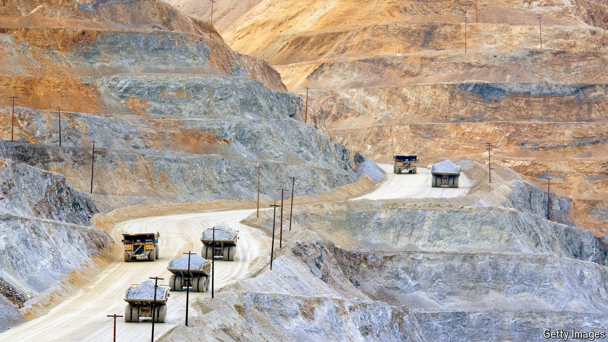

###### Mine your own business

# BHP and Rio Tinto are heading in different directions 

##### The strategies of the world’s two most valuable miners are diverging 

 

> Oct 17th 2024 

For years BHP and Rio Tinto, the world’s two most valuable miners, moved in lockstep. During the 2000s the twin Anglo-Australian giants rose on the back of China’s demand for commodities, particularly iron ore. In 2007 they even explored a merger (regulators rebuffed the idea). Then, when the commodity supercycle crashed in 2015, both landed in investors’ bad books, and were forced to shed assets and pay down their debts. Now, as the pair look to make the most of the energy transition, they are placing diverging bets on the future.

