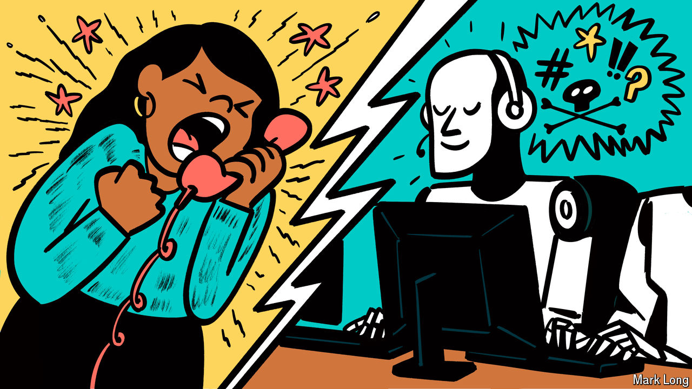

###### Called out

# Can artificial intelligence rescue customer service? 

##### The adoption of AI is surging in call centres 

 

> Oct 16th 2024 

It’s not easy being a —particularly when those customers are so angry with a product that they want to yell at you down the phone. That’s the sort of rage that Sonos, a maker of home-audio systems, encountered in May when it released an app update so full of glitches it caused its share price to plunge. 

