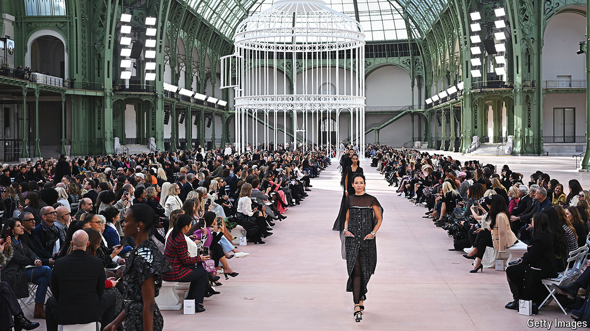

###### On the rack

# Pity the superstar fashion designer 

##### Creative directors are coming and going faster than the latest trends 

 

> Oct 16th 2024 

A giant BIRDCAGE held models wearing Chanel’s latest clothes at its show for Paris fashion week on October 1st. The exhibit in the Grand Palais had all the hallmarks of the 114-year-old fashion house: sophistication, skirt suits and even a little black dress. Yet at the end there was no designer to take the applause. In June Virginie Viard, Chanel’s creative director since 2019, stepped down. Ms Viard was only the third person to hold the role. She took over from , a sharp-tongued German who held the role for 36 years and once called sweatpants “a sign of defeat”. Mr Lagerfeld’s predecessor was Coco Chanel. The front rows of runway shows are now rife with gossip about who will bag fashion’s most prestigious job. An announcement is expected this month.

