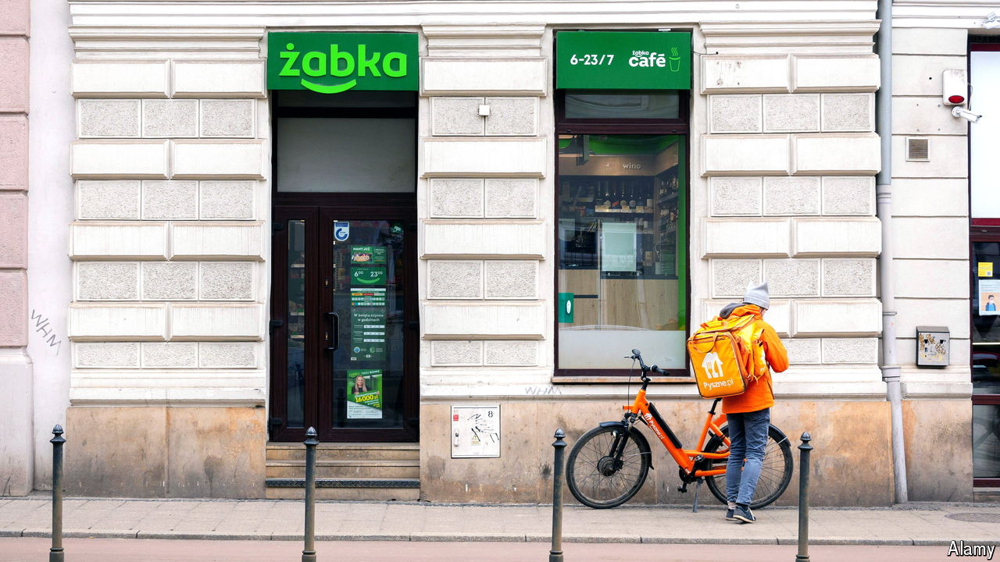

###### Little frog, bigger pond

# Poland’s stockmarket has a hot new entrant 

##### The IPO of Zabka could help revive Warsaw’s beleaguered bourse 

 

> Oct 17th 2024 

IF A POLE runs out of milk on a Sunday morning, they will probably head to Zabka, a convenience store. It is rarely a long walk. Roughly 17m people, nearly half of Poland’s population, live within 500 metres of one of its more than 10,500 outlets. Some may now buy a slice of the retailer itself: on October 17th its owner, CVC, a European private-equity firm, listed a third of Zabka’s shares on the Warsaw Stock Exchange (WSE) at a valuation of 21.5bn zlotys ($5.5bn). The deal has brought a boost to Poland’s beleaguered bourse.

