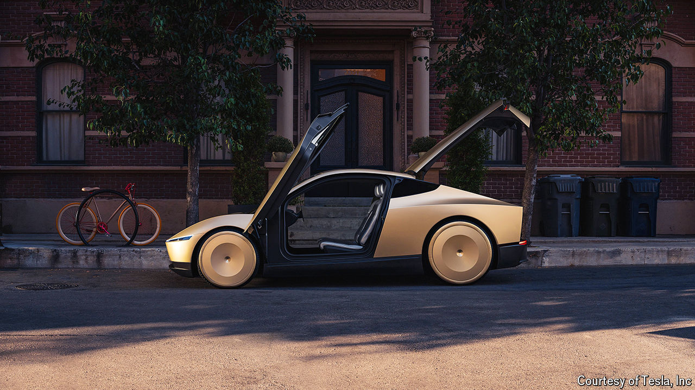

###### Autonomous cars

# The trouble with Elon Musk’s robotaxi dream 

##### Scaling up self-driving taxis will be hard, and competition will be fierce 

 

> Oct 13th 2024 

Elon Musk’s choice of Warner Bros Studios for the long-anticipated launch of his robotaxi on October 10th was entirely appropriate. Hollywood’s film studios are as much a dream factory as . The vision he served up, accompanied by whoops of delight from the superfans in the audience, is an autonomous Cybercab so cheap that it will serve as “individualised mass transit”. But Mr Musk’s promises were, like many Hollywood movies, long on bombast and short on reality. The road to self-driving taxis will be long, and Tesla will face  along the way.

