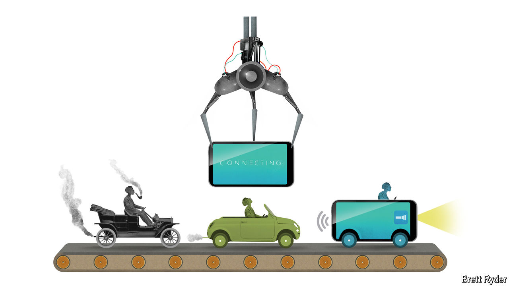

###### Schumpeter

# What if carmaking went the way of consumer electronics? 

##### The Foxconnification of electric vehicles 

 

> Oct 17th 2024 

CARS AREN’T what they used to be. This is not a petrolhead’s lament. It is a statement of technological fact. These days even automobiles powered by a growling V8 engine contain a few kilometres of electrical wires, up from a few hundred metres in the 1990s, plus a thousand semiconductor chips and millions of lines of computer code to control everything from locks and antilock brakes to infotainment. And that is before you get to the electric vehicles (EVs) that are set to one day hog the world’s roads, a recent slowdown in sales notwithstanding, let alone to Elon Musk’s self-driving Cybercabs. The battery and other electronics make up more than half the value of components in an EV, compared with a tenth in that V8. Now, 17 years after Apple gave the world the iPhone and 13 since Toyota somewhat prematurely coined the phrase “smartphone on wheels”, modern cars have a lot in common with consumer gadgets.

