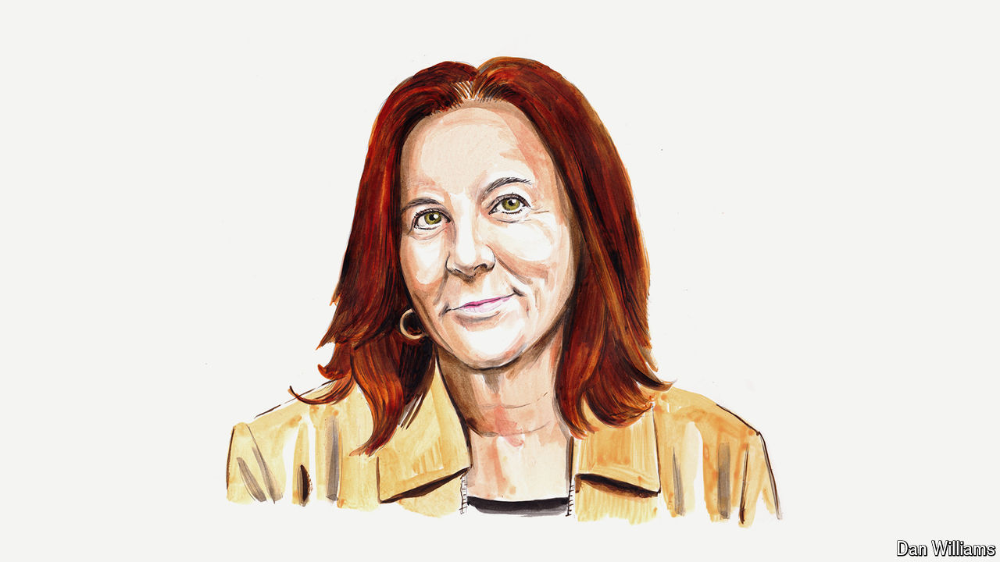

###### America’s election

# Europe should not see a potential Trump return as a threat, says Nadia Schadlow 

##### The former deputy national security adviser says there is room for mutual benefit 

 

> Oct 17th 2024 

DONALD TRUMP has long made it clear that no one speaks for him. Nonetheless, it is probably safe to say that if elected he would pursue a foreign policy consistent with that of his first term. Regarding Europe, he would be likely to highlight many of the same problems he already has: inadequate defence spending, a lack of energy diversification and trade protectionism. Many Europeans acknowledge these problems. They could therefore create opportunities for America and Europe to work together—if they resist the temptation to cast Mr Trump as the problem.

