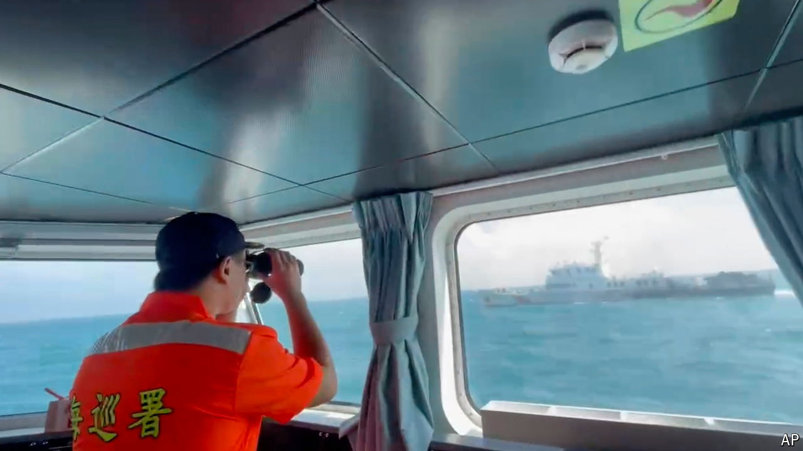

###### Drill, baby, drill

# China makes love and war with Taiwan 

##### The government in Beijing tests the armed forces—and its own messaging 

 

> Oct 17th 2024 

CHINA’S WAR games around Taiwan on October 14th broke records for a single-day drill. The People’s Liberation Army (PLA) employed 153 aircraft. Taiwan’s defence ministry also spotted 26 ships, including a Chinese aircraft-carrier. As if that were not enough, China’s coastguard carried out an unprecedented patrol around Taiwan’s main island, calling it a “practical action to control Taiwan island in accordance with the law based on the one-China principle”.

