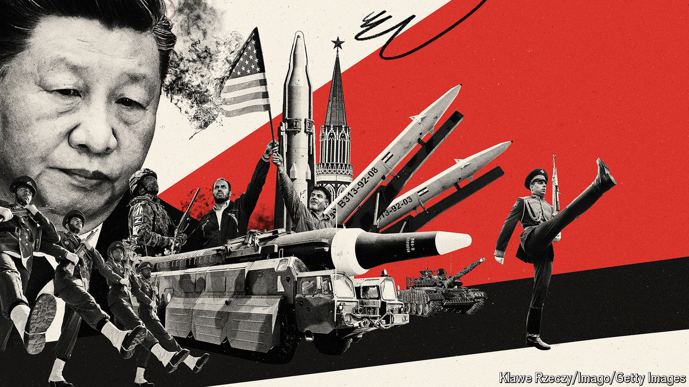

###### The view from Beijing

# Does China welcome—or dread—an Iran-Israel war? 

##### It wants American interests to suffer, but not at any price 

 

> Oct 15th 2024 

LAST MONTH, as tensions escalated between , China helped organise a Chinese film festival in the Iranian capital, Tehran. It opened with a blockbuster: “The Battle at Lake Changjin”. The drama portrays the heroism of Chinese soldiers who fought against American troops in the Korean war of 1950-53. “Strike one punch to avoid a hundred,” Mao Zedong is shown exhorting his colleagues. Nationalist bloggers in China crowed about the film’s showing. “Iran cannot sit idly by, even if the United States is behind Israel!” wrote a widely read scribe. 

