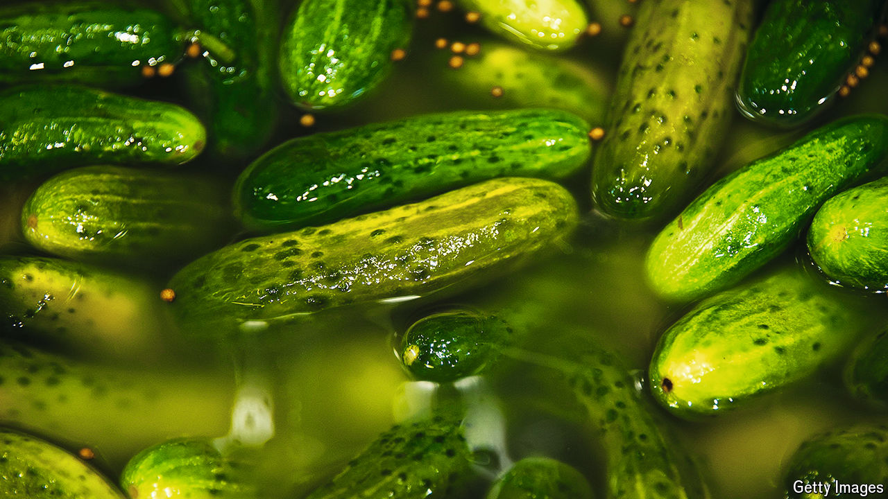

###### World in a dish

# Food lovers the world over are tickled by pickles 

##### On social media, preserved cucumbers are freshly trendy 

 

> Oct 16th 2024 

IN DAYS GONE by, the pickled cucumber—or gherkin, in British parlance—had a humble role in food. It showed up ornamentally or in tiny, grease-cutting portions on burgers and charcuterie boards. So limited were its uses that jars would languish at the back of refrigerators for years. 

