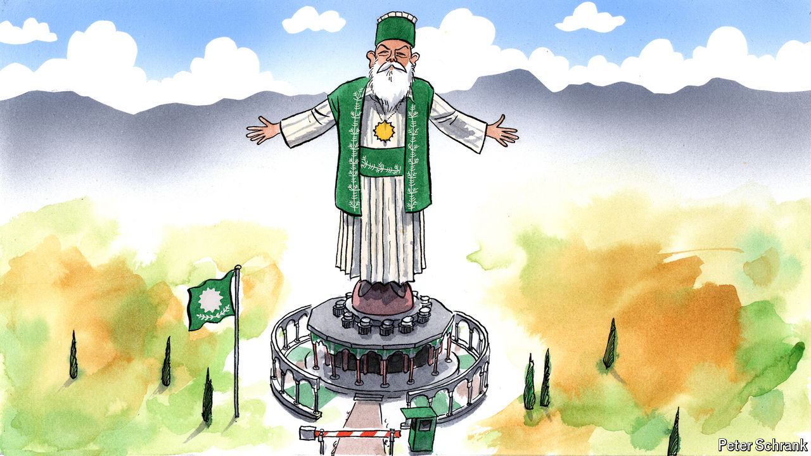

###### Charlemagne

# Hopes for religious harmony come to life in the Muslim Vatican 

##### Albania wants to put the “state” in “Islamic state” 

 

> Oct 17th 2024 

Charlemagne makes it a point to lay off heavy liquor until after lunch. But what if the booze being proffered is a mere thimble of , a fruity firewater Balkan hosts foist upon visitors in a gesture of hospitality? What if, furthermore, the host in question is a Muslim cleric, unexpectedly keen to lubricate your columnist as he explains the tenets of his faith while himself puffing away at a stubby cigar? And what if, finally and yet more improbably, the bottle-wielding holy man is soon to become the head of the world’s newest state, a diminutive Muslim sovereign enclave carved out of the low-rent suburbs of the capital of Albania? It was pushing noon after all. Perhaps a small shot.

