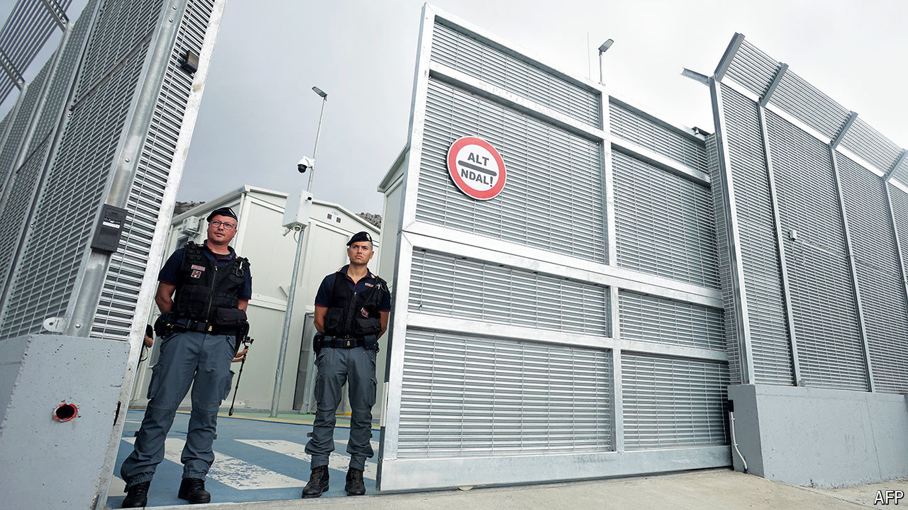

###### Out of sight, out of mind?

# Italy starts outsourcing its migrant crisis to Albania 

##### As European governments grapple with irregular migration, some are looking outward 

 

> Oct 16th 2024 

The first camp for asylum-seekers built by an eu country outside the eu spreads across an area the size of ten football pitches near the village of Gjader in northern Albania. This week 16 Bangladeshis and Egyptians, who had been picked up in the Mediterranean, disembarked in Albania, destined for the site. It was an important moment, and not just for Italy, which has sponsored and built the Albanian centre. After  and thwarted plans, for the first time an  has begun to process asylum claims in a third country. 

