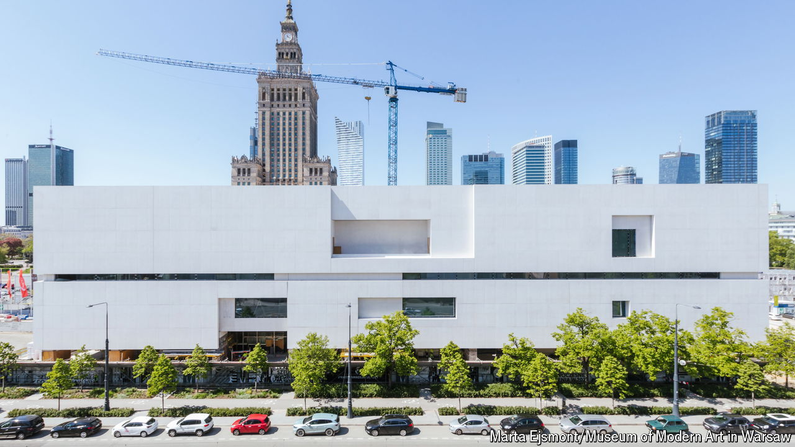

###### Reclaiming the centre

# Poland’s new modern-art museum wants to give the capital a fresh look 

##### Warsaw smooths its rugged historical edges 

 

> Oct 17th 2024 

IT HAS BEEN compared to a shoebox, a parcel locker and an unmarked IKEA warehouse. Ahead of its opening on October 25th, Warsaw’s new Museum of Modern Art is an emotive topic for Varsovians. Some praise the three-storey white box for its cool minimalism. Others say it is a missed opportunity to create a statement building, like the Guggenheim in Bilbao, to beautify the scarred Polish capital.

