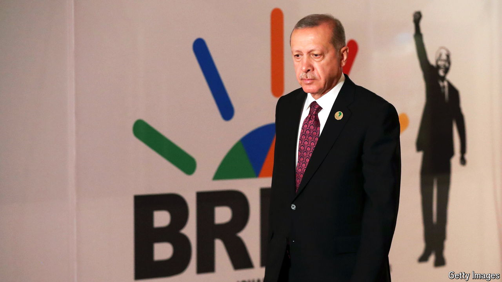

###### Between BRICS and a hard place

# The limits of Turkey’s strategic autonomy 

##### Choosing between autocrats and democracies 

 

> Oct 17th 2024 

FOR OVER a decade, BRICS summits have featured the same cast of characters, meaning the leaders of Brazil, Russia, India, China, and South Africa. That will change on October 22nd, when the presidents of Egypt, Iran, Ethiopia, and the United Arab Emirates, which joined the club earlier this year, pose alongside Vladimir Putin and other BRICS veterans in Kazan, in south-western Russia. But an even more unusual guest, the leader of a NATO country no less, is expected to make an appearance. Russia has announced that Turkey’s president, Recep Tayyip Erdogan, will be on hand to make the case for his country’s BRICS membership. 

