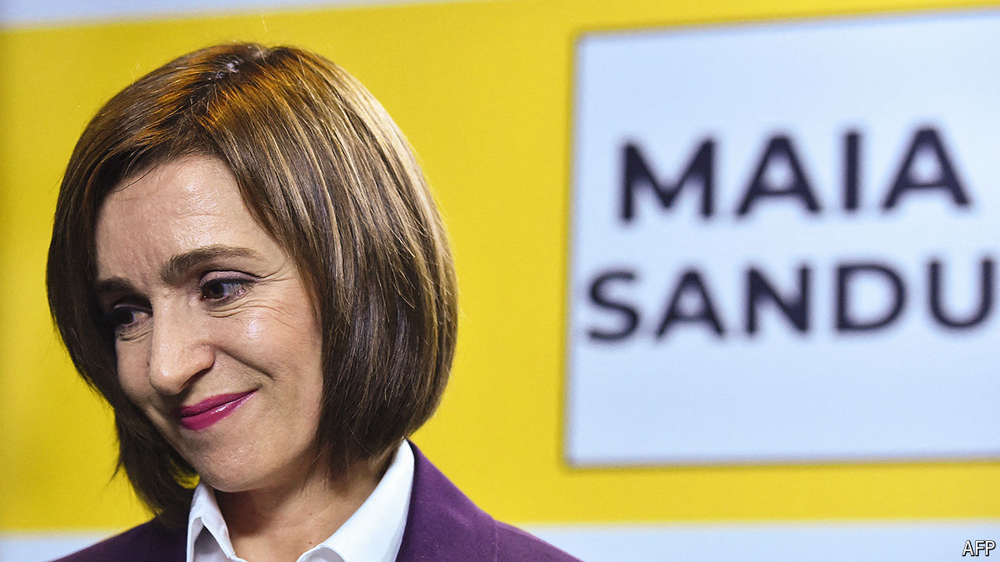

###### Maia Sandu takes a stand

# This tiny country is a laboratory for Russia’s dirty tricks 

##### The Kremlin wants to rig Moldova’s election. The country is fighting back 

 

> Oct 17th 2024 

Since the Soviet Union collapsed, a good quarter of Moldovans—no one knows the figure for sure—have chosen to build new lives abroad. Two decades ago roughly half of such emigrants used to head for jobs in Russia, which had ruled them from 1944 to 1991; the other half tried their luck in western Europe. But now the traffic is nearly all westward. Especially since Russia’s assault on Ukraine in 2022, the entire country of 2.5m or so people, with a few peculiar territorial exceptions, has been pivoting towards the EU. A presidential election and simultaneous referendum on October 20th are expected to confirm this trend—so long as Russia’s unprecedented array of dirty tricks can be fended off.

