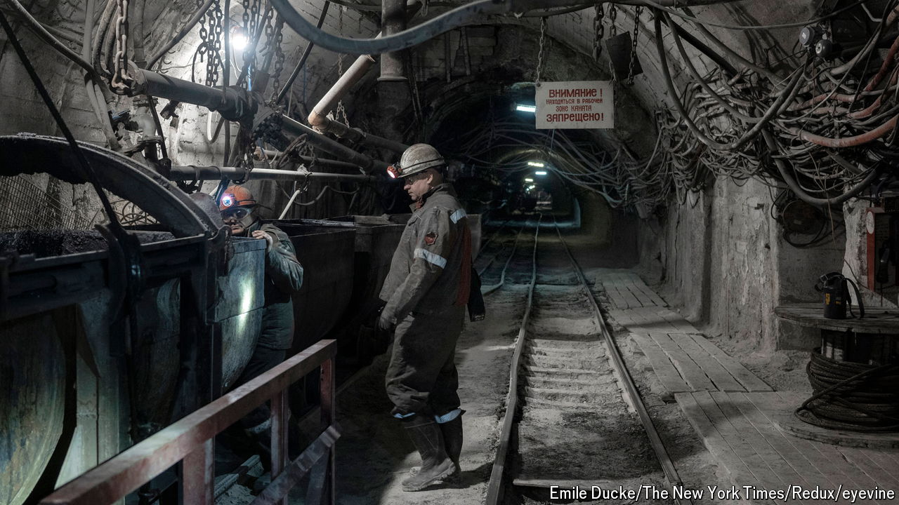

###### Digging for victory

# Why Russia is trying to seize a vital Ukrainian coal mine 

##### Without it, the country’s remaining steel industry will be crippled 

 

> Oct 13th 2024 

ON THE OUTSKIRTS of the eastern city of Pokrovsk two women stand waiting for their lift. Like most civilians in the city they have already fled elsewhere, but they have come back to collect some belongings. They are standing by a boarded-up petrol station which was bustling just a few months ago. Russian troops are , and a full-scale battle for the city is about to be joined. New defensive lines have been dug to the west of Pokrovsk to which, if and when it falls, Ukrainian troops will hope to fall back. 

