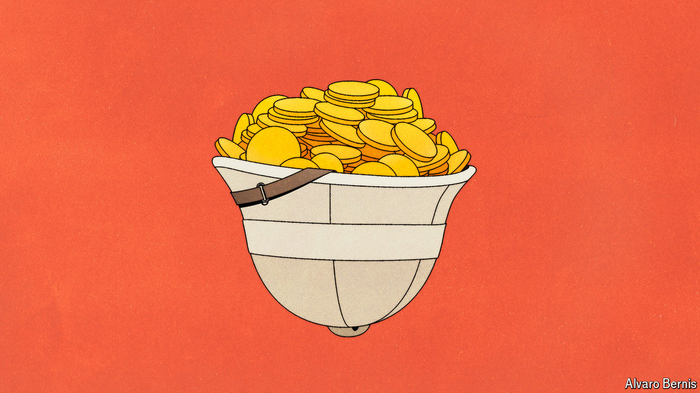

###### Free exchange

# An economics Nobel for work on why nations succeed and fail 

##### Daron Acemoglu, Simon Johnson and James Robinson tackled the most important question of all 

 

> Oct 14th 2024 

Why are some countries rich and others poor? The question, full of childlike curiosity, is the most important in economics. A person’s living standards are mostly determined not by talent or hard work, but by when and where they were born. Historically, models of economic growth focused on the accumulation of factors of production, labour, capital and, more recently, technology or ideas. The greater the capital stock per worker and the more productive its use, then the richer a country would be. 

