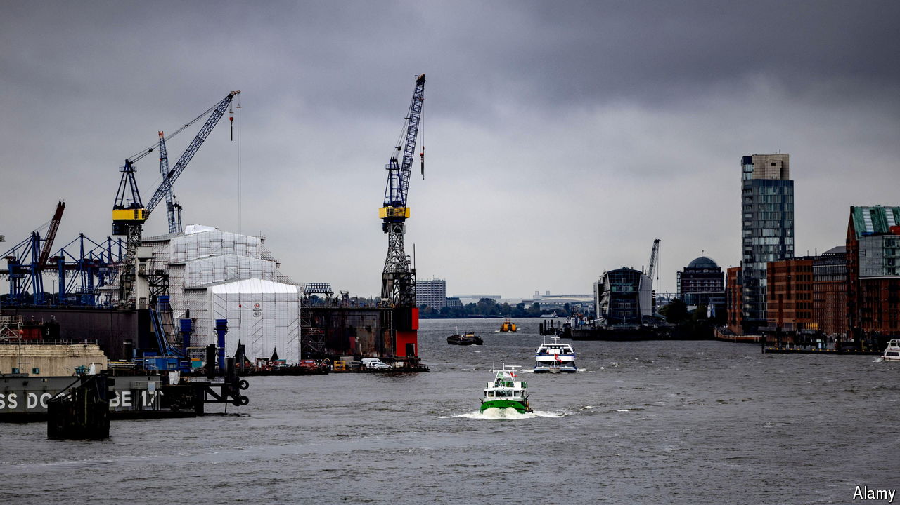

###### Mein Gott

# Germany’s economy goes from bad to worse 

##### Things may look brighter next year, but the relief will be short-lived 

 

> Oct 15th 2024 

It was with Teutonic understatement that  noted economic conditions were “not satisfactory”. Germany’s economy minister was speaking on October 9th, just after official forecasts for the year had been revised from growth of 0.3% to a contraction of 0.2%. This would follow a 0.3% decline in output last year, meaning that  faces its first two-year recession in more than two decades.

