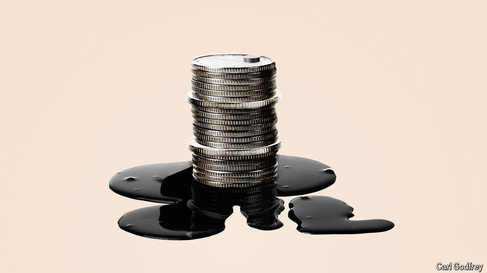

###### Dark commerce

# Inside the secret oil trade that funds Iran’s wars 

##### An investigation by The Economist uncovers a multi-billion-dollar, America-defying network 

 

> Oct 17th 2024 

In a war with Israel, Iran would need money. Not just to buy weapons and keep its economy afloat, but to re-arm militias such as Hamas and Hizbullah. Many assume that, after years of sanctions, it would struggle. They are wrong. Every year Iran funnels tens of billions of dollars from illicit oil sales to bank accounts all over the world. This huge, secret treasure was used to fund Hamas’s attack on Israel a year ago, swarms of Russian drones in Ukraine and Iran’s own nuclear programme. It has already seeded many crises—and could soon fuel the mother of them all. 

