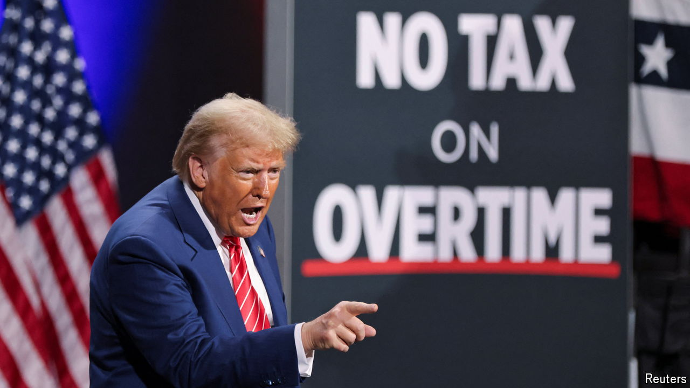

###### Everyone wins

# Trump’s trillion-dollar tax cuts are spiralling out of control 

##### His zany promises would blow up the deficit 

 

> Oct 17th 2024 

For American policy wonks, the final stretch of the presidential election has given rise to a new parlour game. What is the next tax that Donald Trump will promise to cut? The Republican candidate has trotted out a range of pledges, from no taxes on overtime work to no taxes on retirement benefits. Last week alone he proposed three new exemptions, including making interest on car loans tax-deductible. It is easy to figure out what Mr Trump hopes to gain. Yet the economic implications are dispiriting: not just a bigger fiscal deficit but a much messier tax code. 

