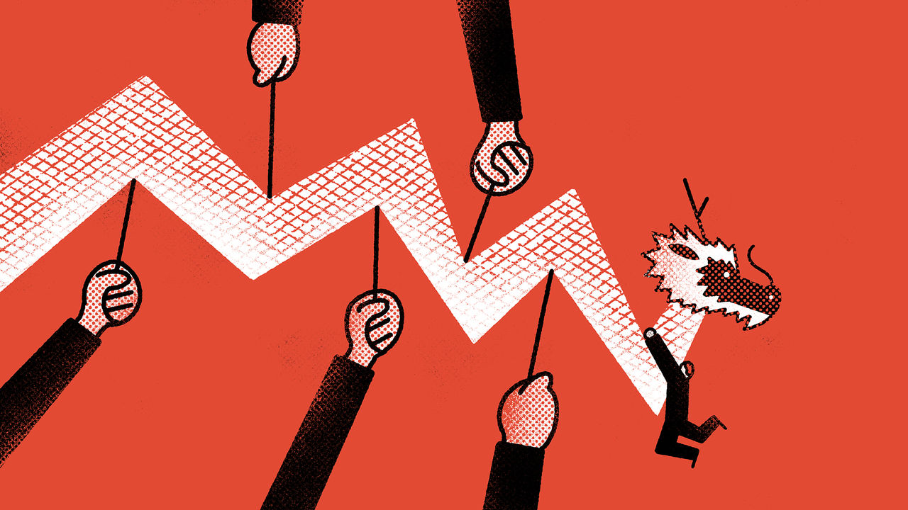

###### Buttonwood

# Why investors should still avoid Chinese stocks 

##### The debate about “uninvestability” obscures something important 

 

> Oct 14th 2024 

Nothing changes sentiment like price, according to one investing maxim. The world-weary saying reflects the fact that after a stockmarket surge speculators usually scramble for reasons to believe further price rises are on the way. A recent surge in the  is one such example.

