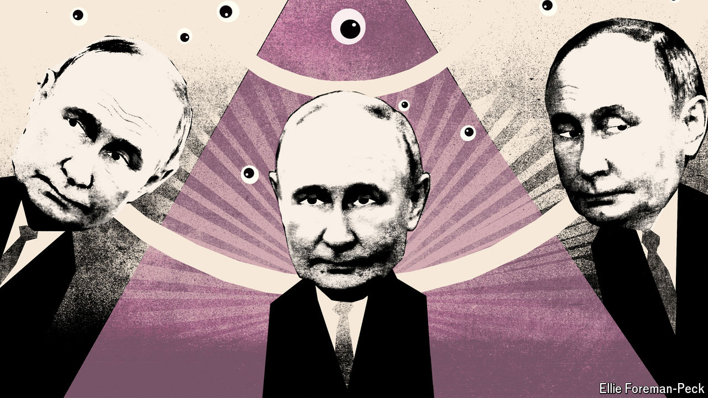

###### Going feral

# Vladimir Putin’s spies are plotting global chaos 

##### Russia is enacting a revolutionary plan of sabotage, arson and assassination 

 

> Oct 13th 2024 

“We’ve seen arson, sabotage and more: dangerous actions conducted with increasing recklessness,” warned Ken McCallum, the head of MI5, Britain’s domestic security and counter-intelligence agency, of the threat posed by Russia and the GRU, its military-intelligence agency. “The GRU in particular is on a sustained mission to generate mayhem on British and European streets,” he said on October 8th. Other European intelligence agencies are equally concerned. On October 14th Bruno Kahl, Germany’s spy chief, said that Russia’s covert measures had reached a “level previously unseen”. Thomas Haldenwang, the head of Germany’s domestic intelligence services, told lawmakers that an act of sabotage had almost caused a plane to crash earlier this year as he warned that “aggressive behaviour” by Russian spies was putting lives at risk. 

