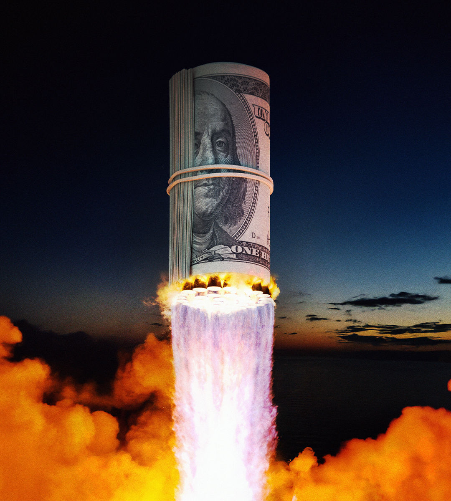

###### The envy of the world

# America’s economy is bigger and better than ever 

##### Will politics bring it back to Earth? 

 

> Oct 17th 2024 

Few sights have better captured America’s world-beating ingenuity. On October 13th a giant booster rocket built by SpaceX hurtled to the edge of the atmosphere before plunging back to Earth and being neatly caught by the gantry tower from which, only minutes earlier, it had taken off. Thanks to this marvel of engineering, big rockets could become reusable and space exploration . Yet, just as the launch was a testimony to American enterprise, so Elon Musk, SpaceX’s founder, captures all that is going wrong with its politics. In his support for Donald Trump, Mr Musk has spread misinformation about voter fraud and hurricane relief and derided his opponents as ill-intentioned idiots.

