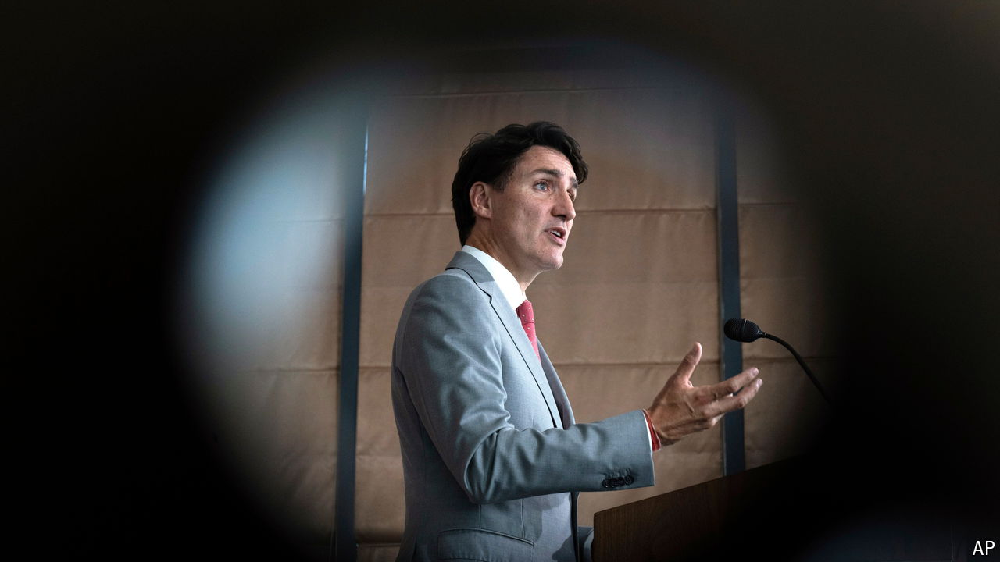

###### Justin’s time

# Canada’s Trudeau trap 

##### How the world’s most reasonable country grew sick of centre-left liberalism 

 

> Oct 17th 2024 

Most outsiders think of Canada as a freezing but pleasant place. It is open and tolerant, and its people are famously nice. But lately the country’s politics have become a cauldron of recrimination. The reign of Justin Trudeau, the prime minister since 2015, is nearing what appears to be a bad end. As its poll ratings collapse, his party may even oust him.

