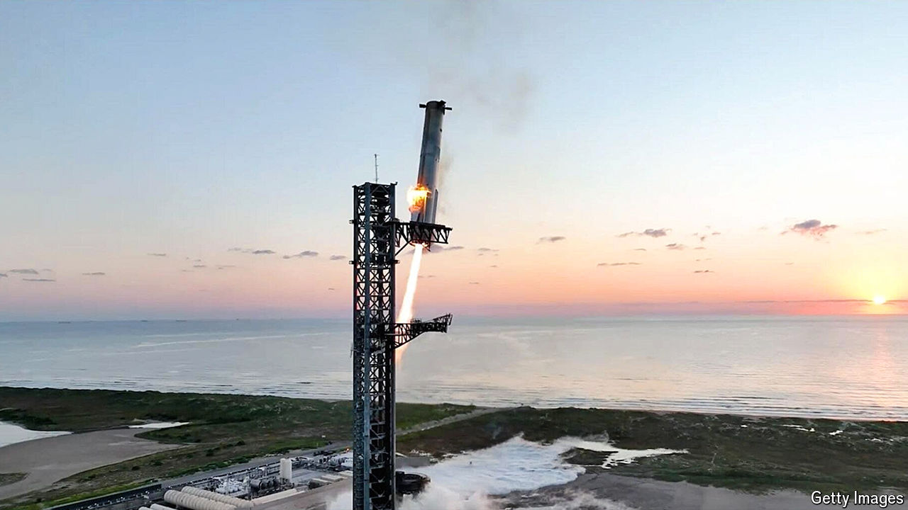

###### Space travel

# Starship will change what is possible beyond Earth 

##### The successful test-flight of SpaceX’s massive new space vehicle promises a host of new projects, including the colonisation of Mars 

 

> Oct 16th 2024 

IN ANY NORMAL week, the biggest-ever interplanetary probe blasting off to look for signs of life in the depths of an occult ocean would hog the headlines about space. But the launch of  was eclipsed, spectacularly, by the test flight the previous day of the Starship being developed by SpaceX, a launch provider, satellite-communications supplier and Mars-settlement enabler founded and run by Elon Musk. Seven minutes  a thin, waggling finger of rocket-fire guided the launcher’s huge first stage back to its launchpad in Texas, there to be grasped like the quarry of a giant praying mantis. 

