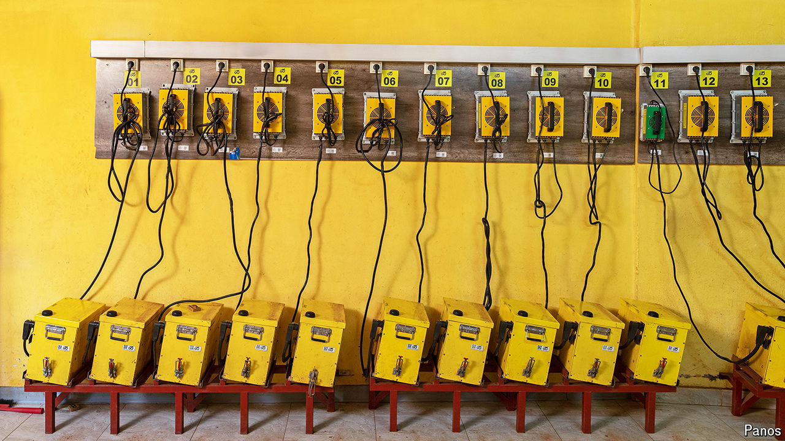

###### Next-generation transportation

# Africa’s EV revolution has two wheels not four 

##### E-bikes are cheaper and less likely to choke you 

 

> Oct 17th 2024 

With his electric motorcycle resting on the curbside, Stephen Omusugu explains the economics. The two-wheel-taxi man from Nairobi, Kenya’s capital, went electric a month ago, after watching several of his colleagues do the same. He took out a loan for the new e-bike, which will take him two years to repay in daily instalments. Added to that is the cost of charging the bike’s electric battery or swapping it for a full one each day. All told, Mr Omusugu reckons, he can make 2,500 Kenyan shillings ($19.35) every day, two and a half times as much as when he rode a petrol-powered bike. 

