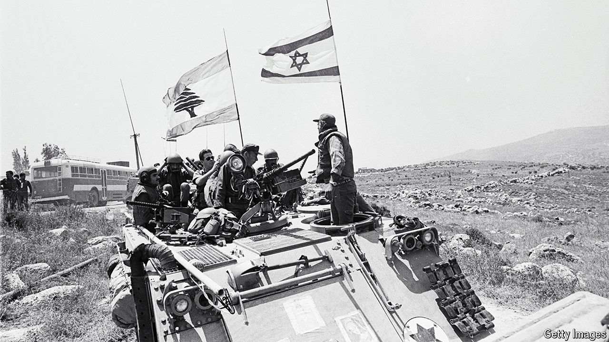

###### Once more, with feeling

# Bad ideas are back on the menu in the Middle East 

##### From a proxy force in south Lebanon to regime change, what’s old is new again 

 

> Oct 17th 2024 

In the late 1990s Israel started work on a memorial to honour the South Lebanon Army (SLA), its proxy force during its occupation of Lebanon. It was inaugurated in May 2000, two days before Israeli troops withdrew from the country. The SLA collapsed almost immediately; its fighters fled to Israel or surrendered. The monument was blown up by Hizbullah.

