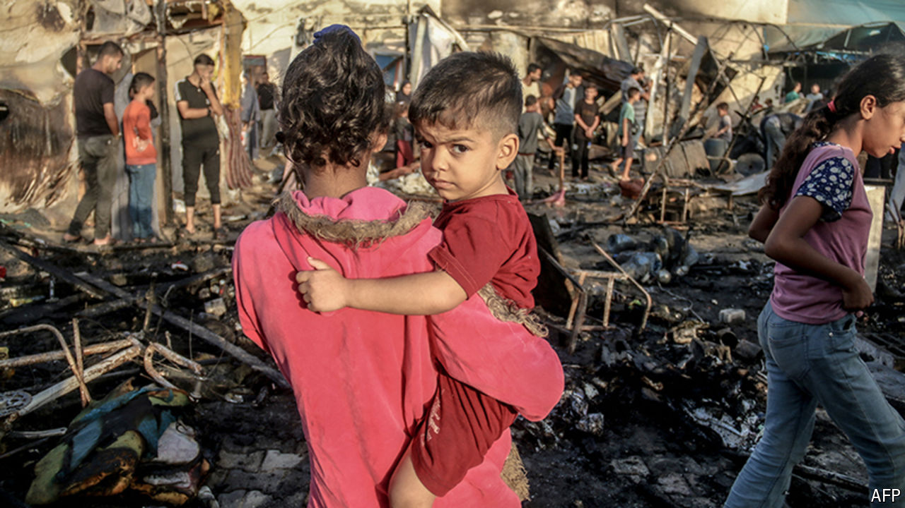

###### Hell and horror, again

# Does Israel’s new plan for Gaza include withholding food? 

##### Israel’s government says no, but America is demanding the ramping up of supplies 

 

> Oct 16th 2024 

HARROWING FOOTAGE of limbs attached to intravenous drips inside burning hospital tents in Deir al-Balah in Gaza on October 14th was a reminder that the war there—one of several fronts Israel has been fighting on since Hamas massacred 1,200 people a year ago—is far from over. Although the world’s focus is on Lebanon and a possible Israeli retaliation against Iran, the horror in Gaza continues.

