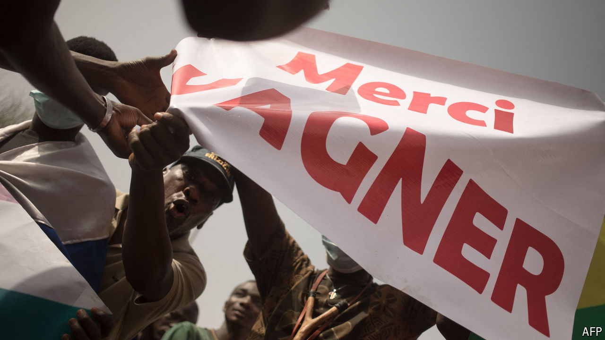

###### A study in resilience

# How Wagner survived Yevgeny Prigozhin’s death 

##### Its mercenary model is still effective in Africa’s most fragile places 

 

> Oct 17th 2024 

True friends, says Hassan Bouba, swigging from a mug with Vladimir Putin’s face on it, “are those who are by your side in the most difficult moments. And Russia was with us in the most difficult of moments.” Mr Bouba is the minister of livestock in the Central African Republic (CAR), one of the world’s poorest and most fragile countries. He is referring to the help the Wagner Group, a Russian mercenary outfit, gave his government in dispatching an armed rebellion nearly four years ago. But Mr Bouba could equally have more personal memories in mind. In 2021 the minister was arrested by a UN-backed special court and charged with war crimes he allegedly committed when he was a rebel fighting a previous government. Yet after only a week in prison he was freed. Many suspected that Mr Bouba, known for his close personal ties to Wagner, had his Russian friends to thank. 

