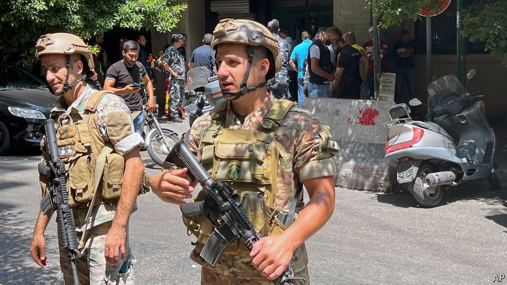

###### Above the fray

# Lebanon’s army is less useless than its reputation suggests 

##### It is one of the few remaining institutions holding the country together 

 

> Oct 17th 2024 

In a country that has just been invaded by Israel, you might expect soldiers to be manning watchtowers. In Lebanon, they are just as likely to be spotted driving taxis. With money tight and morale low, General Joseph Aoun, the army chief, is letting his roughly 80,000 soldiers bunk off from duty several days a week to supplement their meagre wages, which have fallen to as little as $100 a month since the country’s economic meltdown in 2019. This pragmatic policy has stopped soldiers from defecting completely, so they show up to work at least on the days they are not officially moonlighting. That has kept Lebanon’s army functioning even as just about everything else resembling a state has crumbled around it. 

