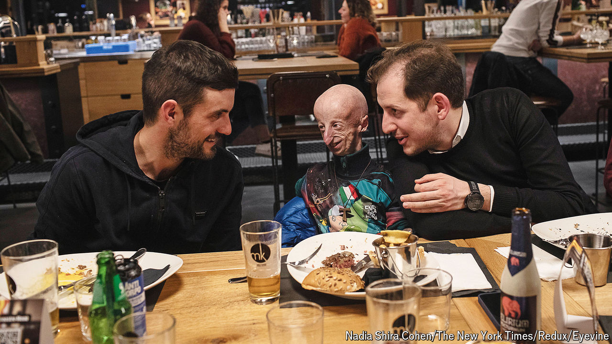

###### The boy who aged too fast

# Sammy Basso led research into his own rare disease 

##### The Italian biologist and longest-lived progeria patient died on October 5th, aged 28 

 

> Oct 17th 2024 

Like any 18-year-old, Sammy Basso had grand ideas for the summer he left high school. They involved friends, beer, beaches, good books, and definitely no work. Just one great big relax. His parents, however, seemed to have other plans. Maybe, knowing his horror of needles and puncturing, they had enrolled him in a sewing course? Or did they mean to put him on a strict vegetarian diet, a centrifuge of aubergines? The truth astonished him. They were all going to America, and on the ultimate road trip, east-west along Route 66 from Chicago to Los Angeles. 

