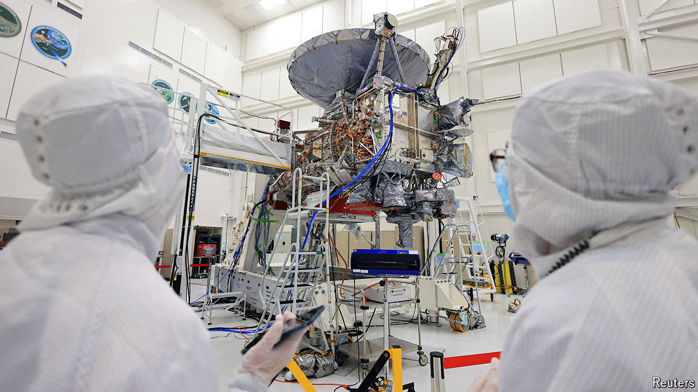

###### Forget about Mars

# Could life exist on one of Jupiter’s moons? 

##### A spacecraft heading to Europa is designed to find out 

 

> Oct 11th 2024 

Besides Earth itself, Mars is the most-studied planet in the solar system. One reason for the abundance of probes and landers, of course, is that Mars is relatively close. Another is that Mars appears to have once had plenty of liquid water on its surface. And where there is water, astrobiologists whisper about the possibility of life. 

