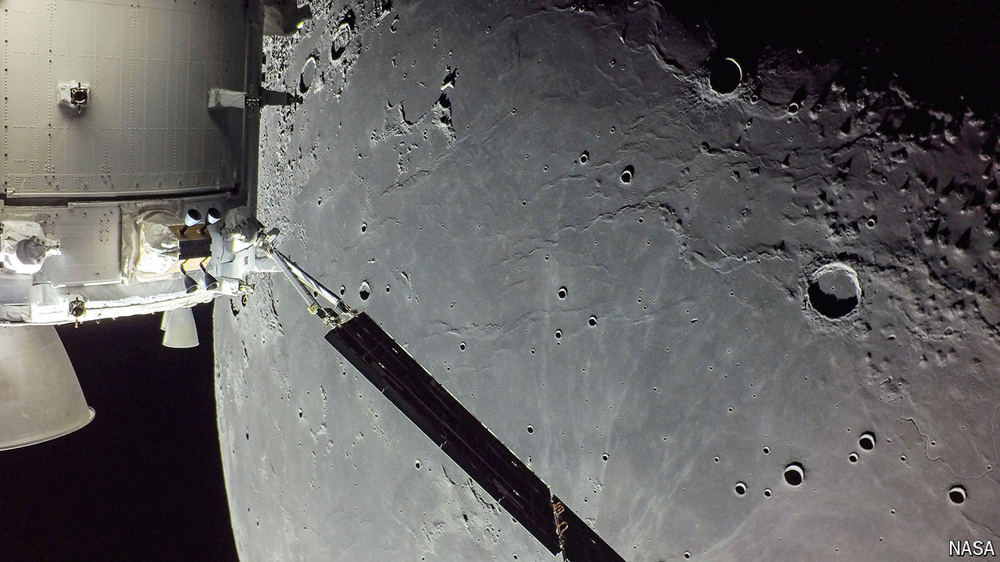

###### The new Moon race

# SpaceX is NASA’s biggest lunar rival 

##### The company’s successes are also showing up the agency’s failings 

 

> Oct 17th 2024 

It was something amazing—an expensive, delicate ship falling out of the sky with such precision that it could be caught in a waiting pair of giant, gentle arms. If you wanted an illustration of the fact that Americans can do things in space beyond the reach of other earthlings the return of the booster stage of SpaceX’s fifth Starship test flight on October 13th could hardly be bettered. 

