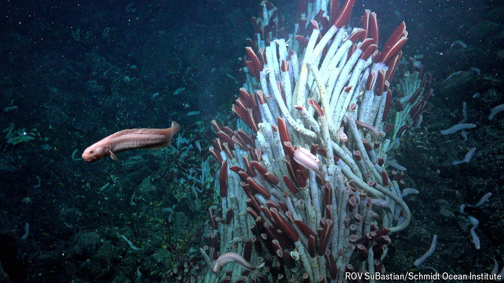

###### Life finds a way

# Tubeworms live beneath the planetary crust around deep-sea vents 

##### The conditions are hot, sulphurous and low in oxygen 

 

> Oct 16th 2024 

HYDROTHERMAL VENTS are the planet’s exhaust pipes. Kilometres below the ocean surface, they relentlessly belch out searing hot water rife with harsh chemicals from beneath Earth’s crust. When they were first discovered in 1977, nobody expected these inhospitable sites to bear signs of life. And yet, thriving alongside these vents were colonies of tubeworms, mussels and clams entirely new to science. It is hard to think of an environment that could be more hostile. Now, however, new work is revealing evidence that these animals are raising their young in just such a place: the fractured rocks underneath the vents themselves.

