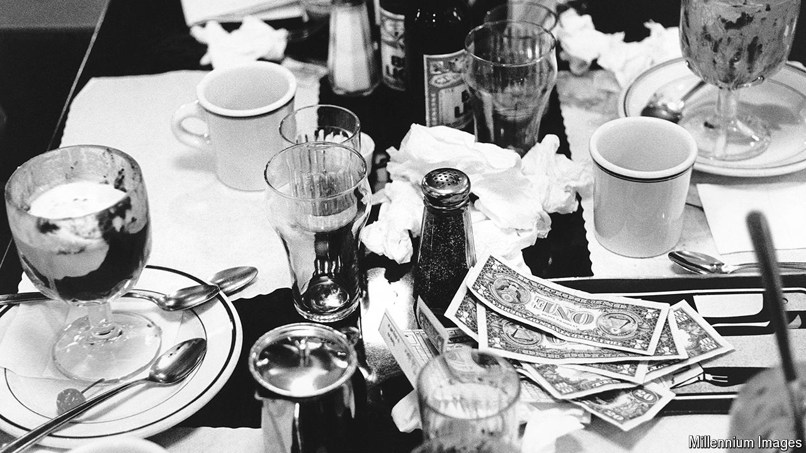

###### The dollar

# China’s yuan is nowhere close to displacing the greenback 

##### The only way the dollar will lose its supreme role is at America’s own hand 

 

> Oct 14th 2024 

AFTER THE collapse of the Bretton Woods system of fixed exchange rates in 1973 the prestige of the dollar looked gutted. America had devalued its currency twice in scarcely a year. “The dollar is regarded all over the world as a sick currency,” said a writer in the ; predictions of falling use of the greenback were rife. Those views, notes Barry Eichengreen of the University of California, Berkeley, in his book “Exorbitant Privilege”, could not have been more wrong. America’s share of the global economy, measured at PPP, did fall from 27% to 23% by 2000. But as the rest of the world parked its growing wealth in New York and governments built up reserves with which to defend their currencies, demand for dollars grew. 

