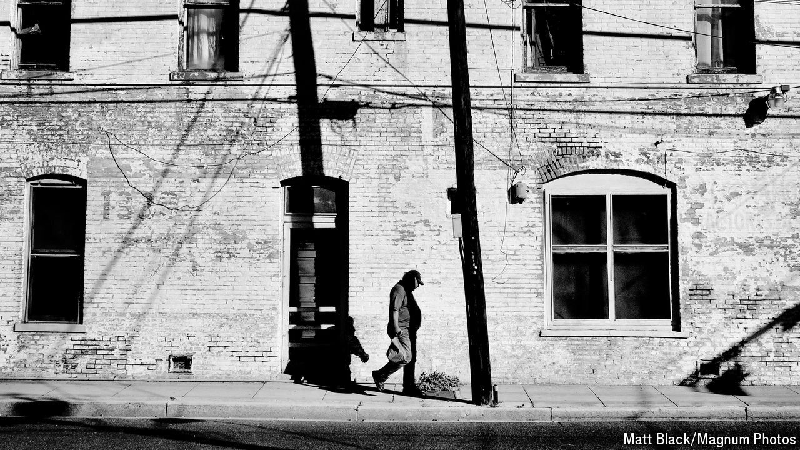

###### For richer and poorer

# Is higher inequality the price America pays for faster growth? 

##### A look at the potential downsides of outperformance 

 

> Oct 14th 2024 

THINK ABOUT income inequality in America and some archetypes easily come to mind. Start with a rich corporate lawyer, earning above the roughly $1m annual income (before taxes and transfers) that places a household in the top 1% of earners. At the other end of the scale, in the bottom 20%, a single mother with a fast-food job might have an income of $25,000. Between them, a home with a mechanic and a part-time teaching assistant might have annual earnings of $80,000, around the median.

