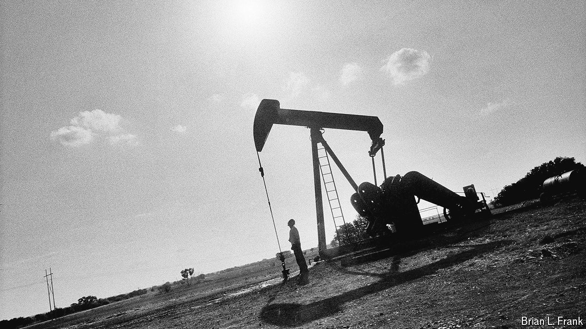

###### Energy

# The shale revolution helped make America’s economy great 

##### But will the country’s oil riches discourage a similar revolution in renewables? 

 

> Oct 14th 2024 

IN THE DENSE hilly forests of northern Pennsylvania, Trapper Wyman steers his pick-up truck down a gravel path until he reaches a small clearing at the end. It is a modest industrial site, with a lattice of pipes and valves, a few engine-like units no bigger than SUVs and one worker who is monitoring it all. The operation runs in almost total silence. Unseen are the wells that plunge some 10,000 feet below the ground, then turn a corner to run another 10,000 feet horizontally, or the gas that flows back up and into a pipeline that traverses the country. This is the Marcellus shale, a family of rocks rich in fossil fuels. For Mr Wyman, owner of a local crane company, it is a site of deep reverence. “You only ever see bits and pieces of the Marcellus above ground, but it is like a giant factory producing energy for America and the world,” he says.

