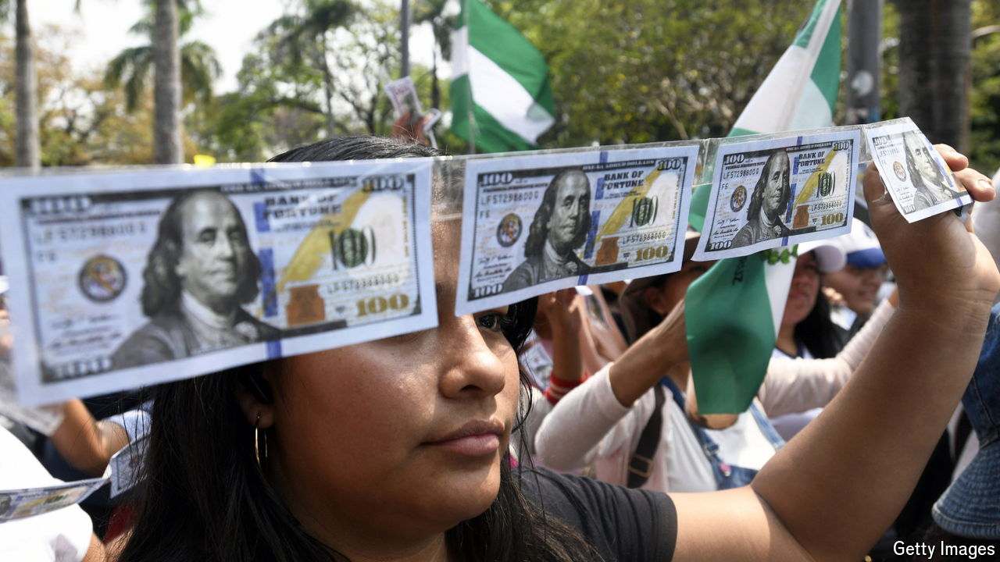

###### Running on empty

# Bolivia’s slow-motion economic crisis is accelerating 

##### Dollars and petrol are scarce, and growth is weak 

 

> Oct 17th 2024 

Pickup trucks hauling empty fuel drums are lined up outside a petrol station next to a field of soyabeans in Santa Cruz, Bolivia. The attendant says the queue hasn’t budged in days: there is no diesel. It’s been this way, on and off, for two months. “And the summer sowing is about to start,” he sighs.

