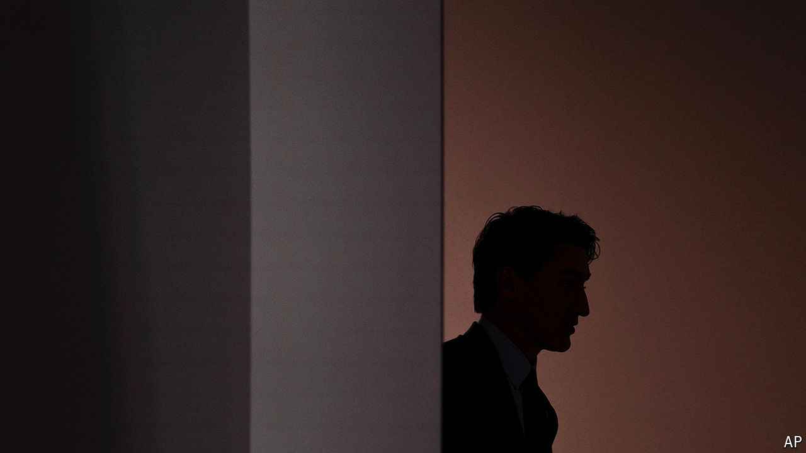

###### The dying of the light

# Justin Trudeau is killing Canada’s liberal dream 

##### His failings hold lessons for liberals the world over 

 

> Oct 14th 2024 

“It is A time of massive anxiety.” Justin Trudeau was talking about Canadians’ , pitching the durability of his liberal project to a gathering of global progressives in Montreal last month. “People notice the hike in their mortgages much more than they notice the savings in their child care,” he offered, perhaps implying that in doing so people failed to appreciate all he did for them.

