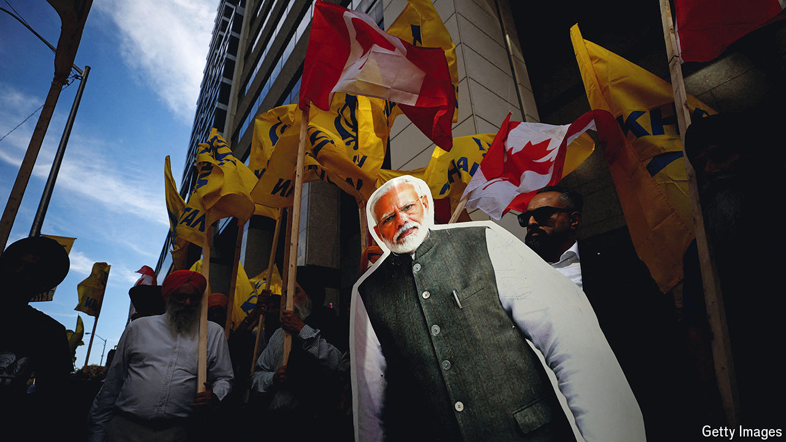

###### India-Canada relations

# The Mounties take on Modi. Who will win? 

##### India’s government has dismissed explosive charges by Canada’s police 

 

> Oct 17th 2024 

Canadian Thanksgiving is usually a sleepy holiday, unnoticed by the rest of the world. Not this year. In a press conference held on October 14th Mike Duheme, the head of the Royal Canadian Mounted Police, accused India’s top diplomat in Canada, Sanjay Kumar Verma, of involvement with a criminal network that has coerced and killed Canadian citizens who support Sikh separatism. 

