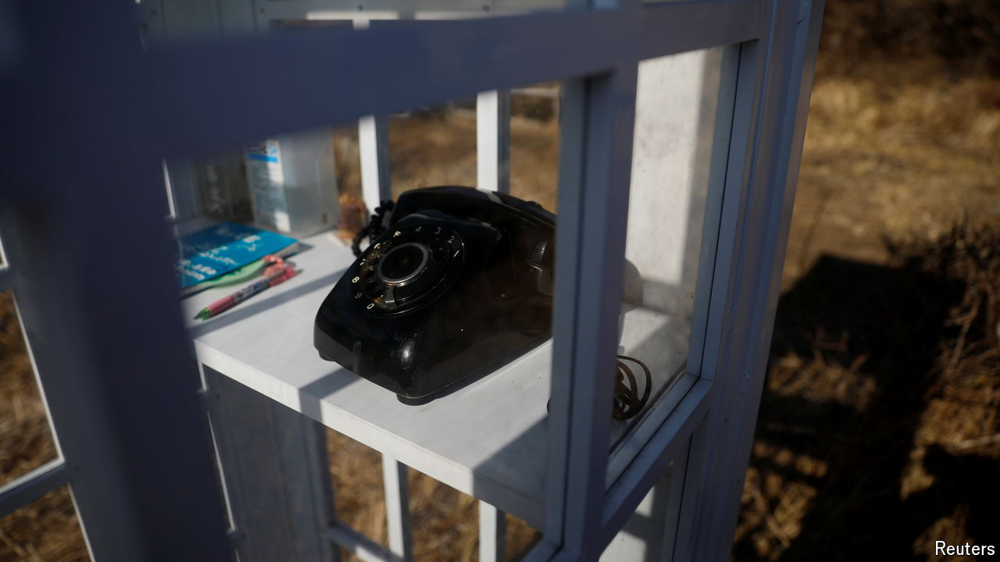

###### The Economist reads

# What to read about grief and bereavement 

##### Six books about feelings that are both universal and unique to the person experiencing them 

 

> Oct 16th 2024 

FEW EXPERIENCES are more solitary than grief. Each mourner knows the loved one in a different way. No one feels the same pain or can predict when they will feel it. Yet grief is also universal. As time goes by, more and more absences populate everyone’s lives. Though inevitable, death—and the emotions it elicits—typically comes as a shock to family and friends. In different ways the writers of these six books, which include memoir, fiction and reportage, evoke the experience of loss, from the earthquake of death to the longer process of learning to live amid the rubble of memories.

