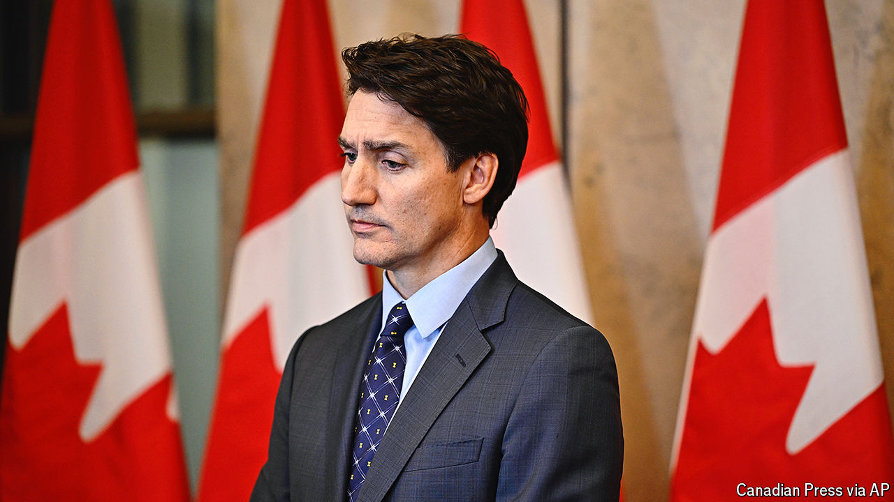

###### The world this week

# Politics 

#####  

 

> Oct 17th 2024 

The diplomatic row intensified between  over the murder of a Sikh separatist near Vancouver. Canada expelled six Indian diplomats, including the high commissioner, claiming a link to the shooting in June 2023 of Hardeep Singh Nijjar, an activist who pushed for a Sikh homeland in India. Explaining the expulsions, Justin Trudeau, the Canadian prime minister, said the police evidence could not be ignored and it was necessary “to disrupt the criminal activities” that threatened public safety. Canadian police described a broad campaign against Indian dissidents in the country involving criminal gangs. A furious India denied the claims and expelled six Canadian diplomats, including the acting high commissioner.

