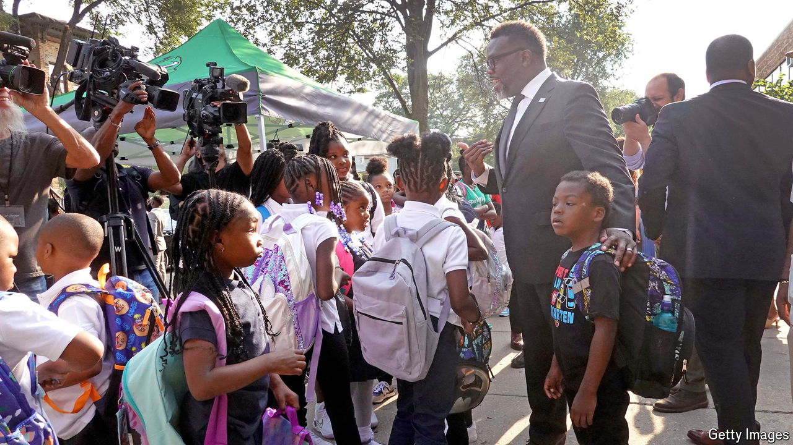

###### Payback time

# Brandon Johnson is giving Chicago’s teachers’ union everything 

##### It may well cost him his political career 

 

> Oct 17th 2024 

Last year, when he was campaigning to be mayor of Chicago, Brandon Johnson, a former organiser for the Chicago Teachers Union, was asked how he would handle negotiating a contract with his former employers, especially when money is tight. He answered simply: “Who better to deliver bad news to friends than a friend?” The teachers’ union downplayed hopes of special favours. “Brandon is a remarkable person who has a lot of principles,” said Jesse Sharkey, a former head of the union.

