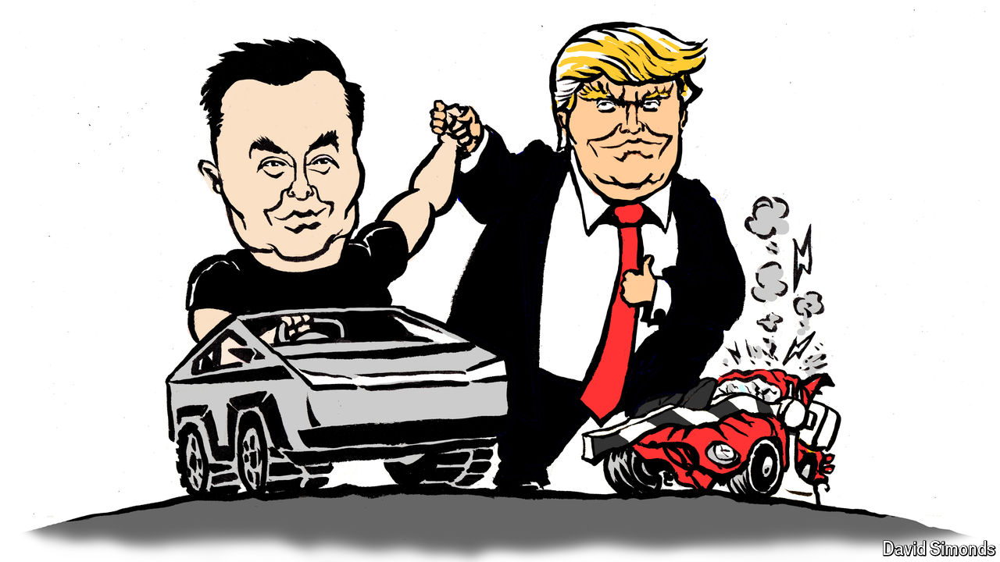

###### Lexington

# One big thing Donald Trump and Elon Musk have in common 

##### They both want to crush Tesla’s competition 

 

> Oct 17th 2024 

Summoning a giant flaming rocket safely home from the edge of space is pretty cool, but Elon Musk’s success in yanking the infamously inertial American car industry in a new direction still ranks among his most impressive achievements. Believing that a transition to sustainable energy was essential to preserving humanity, Mr Musk set out to make Tesla “a guiding light” that would lead other automakers to electrify their cars years before they might have otherwise. The strategy began working almost right away. In 2009, the year after Tesla delivered its first production car, the Roadster, Bob Lutz, a General Motors vice-chairman and a convert to electrification, called Tesla “the crowbar that helped break up the logjam”.

