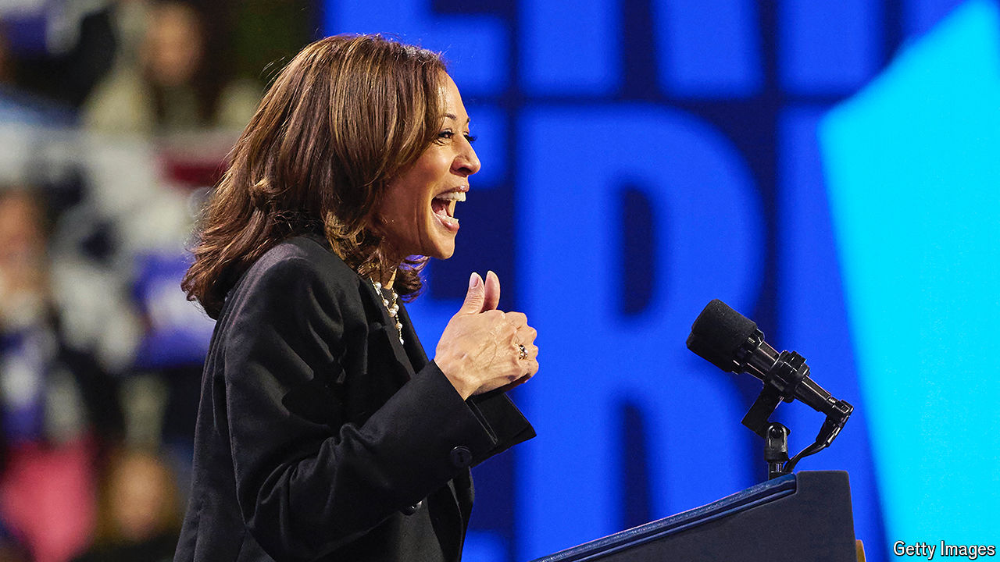

###### Degrees of difference

# Polarisation by education is remaking American politics 

##### The battle for Pennsylvania is a test case for new coalitions of Democrats and Republicans 

 

> Oct 13th 2024 

DEPENDING ON where exactly you find yourself, western  can feel Appalachian, Midwestern, booming or downtrodden. No matter where, however, this part of the state feels like the  Since she became the presumptive Democratic presidential nominee, Kamala Harris has visited western Pennsylvania six times—more often than Philadelphia, on the other side of the state. She made her seventh trip on October 14th, to the small city of Erie, where Donald Trump also held a rally recently. Democratic grandees flit through Pittsburgh regularly. It is where Ms Harris chose to unveil the details of her economic agenda, and where Barack Obama delivered encouragement and mild chastisement on October 10th. “Do not just sit back and hope for the best,” he admonished. “Get off your couch and vote.”

