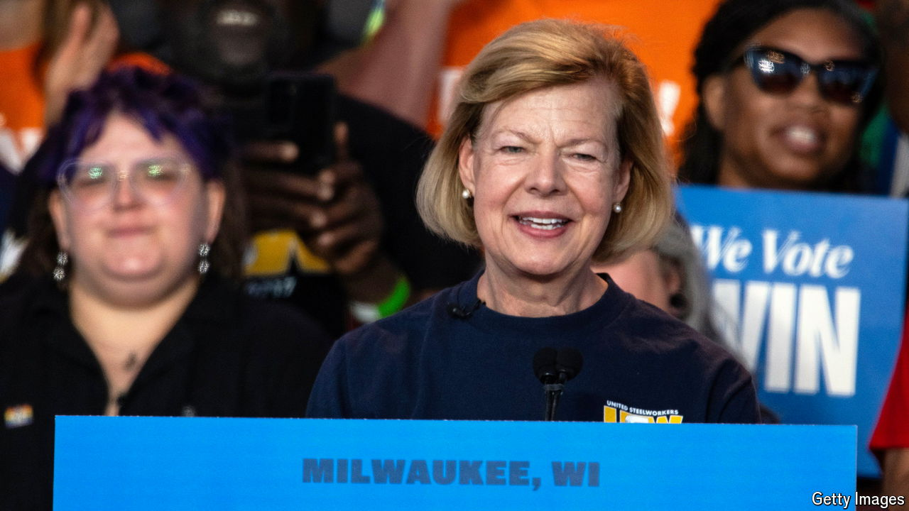

###### Crying over split milk

# Vital election races in Wisconsin are awfully close 

##### America’s dairyland is giving Democrats some heartburn 

 

> Oct 17th 2024 

IT WAS ONCE common for states to split their pair of senators between the two major parties. In 2010 there were 19 such states. Today only three have true splits. In all three of those states—Ohio, Montana and Wisconsin—the Democrat-held seats are up for election in November. And all three could well be lost. Jon Tester faces an uphill re-election bid in Montana. In Ohio, Sherrod Brown, a third-term incumbent, must persuade a large share of Donald Trump voters to split their tickets (an increasingly rare phenomenon) if he is to remain in office. That leaves Tammy Baldwin, the twice-elected senator from Wisconsin, who is campaigning on the least Trumpy terrain of the three.

